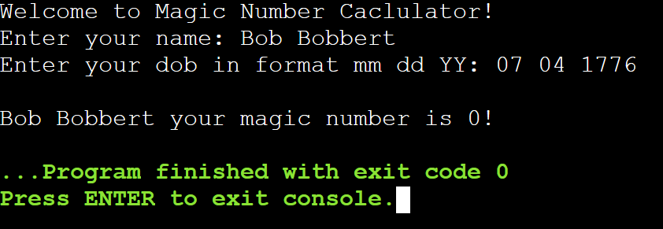

# Lab Assignment 03

In this lab you will practice writing Java code to **perform simple arithmetic**.

Same as Lab Assignment 01 and 02, you need to set up your workspace (class and main() method).

## Let's get started!

First, let's look at the name of our .java file in the `src/` directory and name our class accordingly and remember to make it `public`.

Next, **create your main() method inside your class**. It should be the same as in Lab Assignment 01 and 02. Try writing the main() method without looking at your notes. Writing your main class and method should come to you as natural as in C++.

Now let the fun begin!

### Arithmetic operations

Exactly the same as C++. Only Java has the shift arithmetic operators (<<, >>).

Arithmetic operators **return a numeric value**.

| Operator | Description |
| --- | --- |
| `+` | Adds values together |
| `-` | Subtracts right value from left value |
| `*` | Multiplies values together |
| `/` | Divides right value by left value |
| `%` | Returns the remainder of division |
| `++` | Increments value by `1` |
| `--` | Decrements value by `1` |

Arithmetic operations follow the **PEMDAS** order of operations:

1. Parenthesis
2. Exponents
3. Multiplication & Division
5. Addision & Subtraction

To learn more about Java arithmetic operators visit: https://www.w3schools.com/java/java_operators.asp

## Your Assignment

### Magic Number Calculator

Calculate a person's Magic Number using arithmetic operations in Java. 

A person's `magic_number` is calculated by getting the remainder of dividing the result of multiplying their `birth_month` by their `birth_year`, by their `birth_day`. The equation is:

&emsp;**$Magic$ $Number = (Birth$ $Month$ x $Birth$ $Year)$ % $Birth$ $Day$**

Write a program that will prompt the user for their name and date of birth (DOB), then output their magic number.

**Expected output:**

## Submit your assignment

To submit your lab assignment click on the **Source Control** icon (3 circles with 2 lines) on your leftside navbar. Next, click on the **+** symbol next to **Changes** to stage your changes. Lastly, add a commit message (ex: "First commit") and click **Commit** then **Sync Changes**. And you're done!
